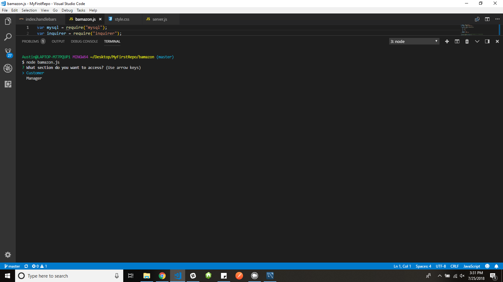
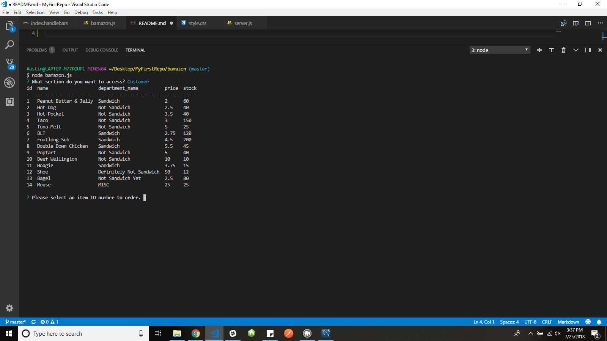
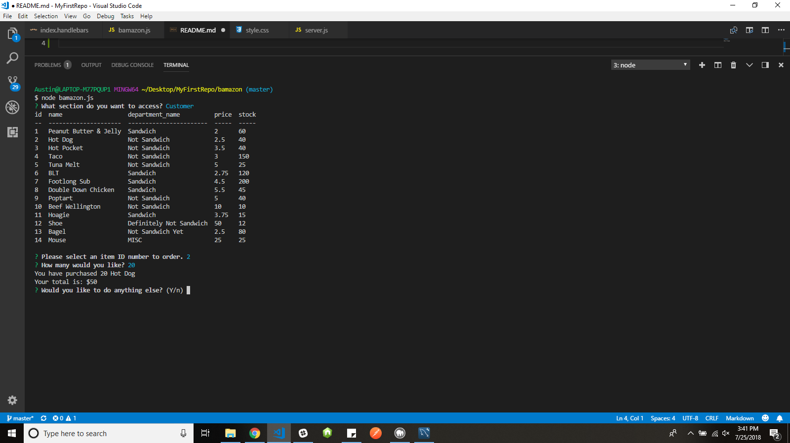
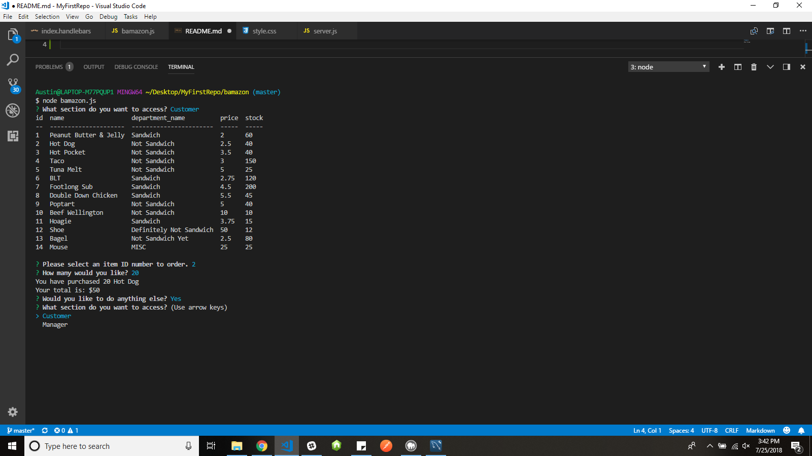
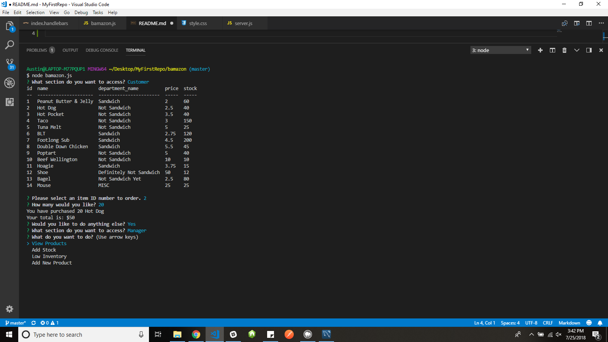
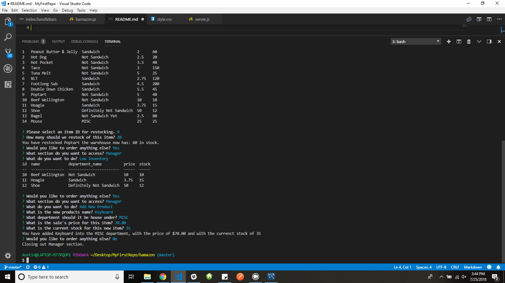

# bamazon

Start Screen: displaying the choice between customer and manager

In customer section it displays your choices for purchase.

I select the item by ID and the quantity I wish to buy and it shows my total and prompts to continue or end application.

Showing when I hit yes continue it goes back to the main prompt.

Choosing the manager section it displays the various options.

Showing the add stock option.

Showing both the low inventory which is anything 15 stock or below and adding a new product.
