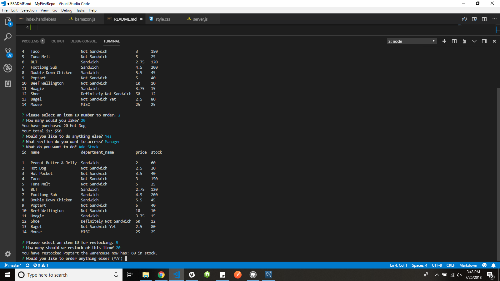

# bamazon

A Node.js application that simulates an ordering system like Amazon.

Always you to select an item from a table, choose how many you want and will tell you what you owe.

It also has a manager side to restock items, see which items have low stock, and add new products.

I did this use Node.js, MYSQL database, and node packages(inquirer and console.table).

Start Screen: displaying the choice between customer and manager

In customer section it displays your choices for purchase.

I select the item by ID and the quantity I wish to buy and it shows my total and prompts to continue or end application.

Showing when I hit yes continue it goes back to the main prompt.

Choosing the manager section it displays the various options.

Showing the add stock option.

Showing both the low inventory which is anything 15 stock or below and adding a new product.
